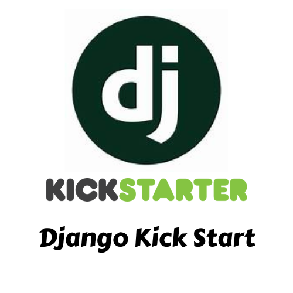

# Django Kick Start – Complete Project Working

<p align="center">
  
</p>

> A VS Code extension for kickstarting Django development with one-click initialization and smart automation tools.

---

## Table of Contents
1. [Overview](#overview)
2. [Architecture](#architecture)
3. [Extension Lifecycle](#extension-lifecycle)
4. [Commands Deep Dive](#commands-deep-dive)
5. [Data Flow & Utilities](#data-flow--utilities)
6. [File Structure](#file-structure)
7. [Configuration](#configuration)

---

## Overview

**Django Kick Start** is a VS Code extension that helps developers set up and manage Django projects without leaving the editor. It provides:

- One-click project creation
- App generation and configuration
- Static file and template scaffolding
- Model creation via a visual UI
- HTML template, static file, view, and URL creation
- Development server run and debug support

**Tech Stack:** TypeScript, VS Code Extension API, Node.js

---

## Architecture

```
┌─────────────────────────────────────────────────────────────────┐
│                     extension.ts (Entry Point)                    │
│  • Registers all commands                                        │
│  • Checks Python installation on activation                      │
│  • Creates output channel                                        │
└─────────────────────────────────────────────────────────────────┘
                                    │
                                    ▼
┌─────────────────────────────────────────────────────────────────┐
│                         Command Handlers                         │
│  initProject | generateApp | staticHelper | templateScaff       │
│  createHtml | createStatic | runServer | createModel | createView│
└─────────────────────────────────────────────────────────────────┘
                                    │
                                    ▼
┌─────────────────────────────────────────────────────────────────┐
│                    pythonUtils.ts (Utilities)                     │
│  checkPythonInstallation | checkDjangoInstallation               │
│  installDjango | executeCommand | validateProjectName            │
└─────────────────────────────────────────────────────────────────┘
```

---

## Extension Lifecycle

### Activation (`onStartupFinished`)

1. **Output channel** – Creates the "Django Kick Start" output channel for logs.
2. **Command registration** – Registers 9 commands with VS Code.
3. **Python check** – Asynchronously checks for Python. If not found, shows a warning with a link to the Python download page.
4. **Error handling** – Each command is wrapped in a try-catch that shows an error message on failure.

### Deactivation

- Disposes the output channel to free resources.

---

## Commands Deep Dive

### 1. Django: Initialize Project (`initProject`)

**Purpose:** Create a new Django project from scratch.

**Flow:**
1. Check Python installation → show error and link to download if missing.
2. Check Django installation → offer to install if missing.
3. Get project name via `showInputBox` with `validateProjectName`.
4. Get workspace folder (current or via folder picker).
5. Inside a progress notification:
   - Run `django-admin startproject <name>`
   - Run `python manage.py startapp myapp`
   - Add `myapp` to `INSTALLED_APPS` in `settings.py`
   - Update project `urls.py` to include `myapp.urls`
   - Create `myapp/urls.py` with `home` view
   - Update `myapp/views.py` with a simple `home` view
   - Run `python manage.py migrate`
6. Show success message with options: "Open Project" or "Run Development Server".

**Files modified:**
- `<project>/<project>/settings.py`
- `<project>/<project>/urls.py`
- `<project>/myapp/urls.py`
- `<project>/myapp/views.py`

---

### 2. Django: Generate App (`generateApp`)

**Purpose:** Add a new Django app to an existing project.

**Flow:**
1. Require a workspace folder.
2. Verify it's a Django project with `python manage.py --version`.
3. Get app name via `showInputBox` (letters, numbers, underscores).
4. Inside a progress notification:
   - Run `python manage.py startapp <appName>`
   - Add app to `INSTALLED_APPS` in `settings.py`
   - Create `urls.py` in the new app
   - Add `index` view to `views.py`
   - Create `templates/<appName>/index.html`
   - Add app URL include in project `urls.py`
5. Offer to open `views.py` or `urls.py`.

**Helper functions:** `findSettingsPath`, `findProjectUrlsPath` (via `findFiles`).

---

### 3. Django: Setup Static Files (`staticHelper`)

**Purpose:** Set up static and media file handling.

**Flow:**
1. Create directories: `static/css`, `static/js`, `static/images`, `media`.
2. Add `static/css/style.css` with sample styles.
3. Find `settings.py` and add:
   - `STATIC_URL`, `STATICFILES_DIRS`, `STATIC_ROOT`
   - `MEDIA_URL`, `MEDIA_ROOT`
4. Update project `urls.py` for media serving in development:
   - Import `settings` and `static`
   - Append `+ static(settings.MEDIA_URL, document_root=settings.MEDIA_ROOT)` to `urlpatterns`.

---

### 4. Django: Generate Templates (`templateScaff`)

**Purpose:** Add a base template and common page templates.

**Flow:**
1. Create `templates/` directory.
2. Write templates:
   - `base.html` – Bootstrap 5 layout, navbar, blocks
   - `home.html`
   - `login.html`
   - `dashboard.html`
3. Update `settings.py` to include `BASE_DIR / 'templates'` in `TEMPLATES[0]['DIRS']` (if not already set).

---

### 5. Django: Create HTML Template (`createHtml`)

**Purpose:** Create an HTML file and wire it to a view and URL.

**Flow:**
1. Get HTML path (must end with `.html`).
2. Create `templates/<path>` and directories.
3. Create HTML file with basic structure and ``.
4. Update `myapp/views.py` with a new view returning `render(request, '<path>')`.
5. Update `myapp/urls.py` with the new URL pattern.
6. Open the new file.

**Note:** Always targets `myapp`; does not support custom app selection.

---

### 6. Django: Create Static File (`createStatic`)

**Purpose:** Create CSS or JavaScript files under `static/`.

**Flow:**
1. QuickPick for file type: CSS or JavaScript.
2. Get file path (must end with `.css` or `.js`).
3. Create `static/<path>` and directories.
4. Add a minimal comment block.
5. Open the file.

---

### 7. Django: Run Development Server (`runServer`)

**Purpose:** Start the Django dev server.

**Flow:**
1. QuickPick: "Run Server" or "Debug Server".
2. Create terminal and `cd` to workspace root.
3. Run:
   - Debug: `python manage.py runserver --noreload`
   - Normal: `python manage.py runserver`

---

### 8. Django: Create Model (`createModel`)

**Purpose:** Add a model via a visual webview UI.

**Flow:**
1. Open a Webview panel with `model-creator.css` and `model-creator.js`.
2. User fills: App Name, Model Name, Fields (name, type, options).
3. On submit, webview sends a message to the extension with `modelName`, `fields`, `appName`.
4. Extension:
   - Writes model class to `models.py`
   - Adds CRUD views to `views.py`
   - Adds URL patterns to `urls.py`
   - Runs `makemigrations` and `migrate` in a terminal

**Supported field types:** CharField, TextField, IntegerField, FloatField, BooleanField, DateField, DateTimeField, EmailField, URLField, ForeignKey, ManyToManyField.

**Webview:** Uses Bootstrap 5, VS Code theming via CSS variables, and `acquireVsCodeApi()` for messaging.

---

### 9. Django: Create View and URL (`createView`)

**Purpose:** Add a simple view (HTTP response) and URL without a template.

**Flow:**
1. Get view name (valid Python identifier).
2. Get URL pattern (must start and end with `/`).
3. Add view to `myapp/views.py`: `return HttpResponse('<name> view response')`.
4. Add URL pattern to `myapp/urls.py`.

**Note:** Always targets `myapp`.

---

## Data Flow & Utilities

### `pythonUtils.ts`

| Function | Purpose |
|----------|---------|
| `checkPythonInstallation()` | Runs `python --version` or `python3 --version` |
| `checkDjangoInstallation()` | Runs `python -c "import django"` |
| `installDjango()` | Runs `python -m pip install django` |
| `executeCommand(cmd, cwd)` | Wraps `child_process.exec` in a Promise |
| `validateProjectName(name)` | Ensures valid Python identifier, not "django" |
| `runTerminalCommand(cmd)` | Opens terminal, sends command, resolves when terminal closes |

---

## File Structure

```
django-kick-start/
├── package.json          # Extension manifest, commands, activation events
├── tsconfig.json         # TypeScript config
├── src/
│   ├── extension.ts      # Entry point, command registration
│   ├── commands/
│   │   ├── initProject.ts
│   │   ├── generateApp.ts
│   │   ├── staticHelper.ts
│   │   ├── templateScaff.ts
│   │   ├── createHtml.ts
│   │   ├── createStatic.ts
│   │   ├── runServer.ts
│   │   ├── createModel.ts
│   │   └── createView.ts
│   └── utils/
│       └── pythonUtils.ts
├── media/
│   ├── logo.png          # Extension icon
│   ├── model-creator.css # Webview styling
│   └── model-creator.js  # Model Creator UI logic
└── out/                  # Compiled JS (from tsc)
```

---

## Configuration

### `package.json` Highlights

- **Activation:** `onStartupFinished`
- **Main:** `./out/extension.js`
- **Categories:** Programming Languages, Snippets, Debuggers, Other
- **Commands:** 9 commands under category "Django Kick Start"

### Generated Django Project Structure

```
your-project/
├── manage.py
├── your_project/
│   ├── settings.py
│   ├── urls.py
│   └── wsgi.py
├── myapp/
│   ├── models.py
│   ├── views.py
│   ├── urls.py
│   └── ...
├── static/
│   ├── css/
│   ├── js/
│   └── images/
├── media/
└── templates/
    ├── base.html
    ├── home.html
    ├── login.html
    └── dashboard.html
```

---

## Summary

Django Kick Start automates the setup and common tasks of a Django project inside VS Code. It uses:

- **Input/QuickPick** for user choices
- **Progress notifications** for long operations
- **Terminal commands** for Django and pip
- **File system API** for reading/writing project files
- **Webview** for the Model Creator

The extension is modular: each command is a separate handler, and shared logic lives in `pythonUtils.ts`. All commands are registered in `extension.ts` and wired to handlers with unified error handling.
