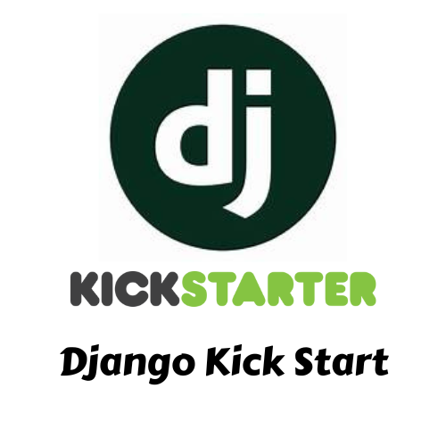

<div align="center">
  <kbd>
    
  </kbd>
  
  <h1>🚀 Django Kick Start 🚀</h1>
  <p><i>A powerful VS Code extension for seamless Django project initialization and management</i></p>
  
  <p align="center">
    <a href="https://github.com/jamalihassan0307">
      
    </a>
  </p>

  <p align="center">
    <a href="https://github.com/jamalihassan0307">
      
    </a>
    <a href="https://www.linkedin.com/in/jamalihassan0307">
      
    </a>
    <a href="https://jamalihassan0307.github.io/portfolio.github.io">
      
    </a>
  </p>

  <p align="center">
    <a href="https://marketplace.visualstudio.com/items?itemName=jamalihassan.django-kick-start">
      
    </a>
    <a href="https://www.python.org">
      
    </a>
    <a href="https://opensource.org/licenses/MIT">
      
    </a>
  </p>

  <p align="center">
    <a href="https://marketplace.visualstudio.com/items?itemName=jamalihassan.django-kick-start">
      
    </a>
    <a href="https://www.djangoproject.com">
      
    </a>
    <a href="https://marketplace.visualstudio.com/items?itemName=jamalihassan.django-kick-start">
      
    </a>
  </p>
</div>

# Django Kick Start

A VS Code extension providing a beginner-friendly Django project setup experience with one-click initialization and smart automation tools.


## 🎯 Features

### 1. Project Wizard (One-click Django Setup)
- Interactive project creation with validation
- Automatic environment checks (Python & Django)
- Default app creation and configuration
- Pre-configured URLs and views
- Initial database setup

### 2. App Generation
- Customizable app name (default: 'myapp')
- Automatic app registration in INSTALLED_APPS
- Pre-configured URL patterns
- Basic view setup with welcome page

### 🚀 Quick Start

1. Install the extension from VS Code Marketplace
2. Press `Ctrl+Shift+P` (or `Cmd+Shift+P` on Mac)
3. Type "Django: Initialize New Project"
4. Follow the prompts to create your project

### ⚙️ Requirements

- Visual Studio Code ^1.85.0
- Python 3.8 or higher
- Django (will be installed automatically if missing)

### 📋 Command Reference

| Command | Description |
|---------|-------------|
| `Django: Initialize New Project` | Start the project creation wizard |
| `Django: Generate New App` | Create a new Django app in your project |
| `Django: Setup Static Files` | Configure static files for your project |
| `Django: Scaffold Templates` | Set up template structure |

### 🔄 What Gets Created

When you run the project initialization:

1. A new Django project with your chosen name
2. A 'myapp' application (default app)
3. Basic URL patterns and views
4. Initial database migrations
5. Ready-to-run development server

### 📁 Project Structure

```
your-project/
├── manage.py
├── your_project/
│   ├── __init__.py
│   ├── settings.py
│   ├── urls.py
│   └── wsgi.py
└── myapp/
    ├── __init__.py
    ├── admin.py
    ├── apps.py
    ├── models.py
    ├── urls.py
    └── views.py
```

### 🆕 What's New in 1.0.1

- Changed default app name from 'core' to 'myapp'
- Improved app generation process
- Enhanced project structure documentation
- Updated VS Code engine compatibility to ^1.85.0
- Improved error handling and user feedback

### 🔜 Upcoming Features

- Static Files Helper
- Template Scaffolding Tool
- Database Configuration Wizard
- Custom App Generator

## 🤝 Contributing

Contributions are welcome! Please feel free to submit a Pull Request.

## 📝 License

This project is licensed under the MIT License - see the LICENSE file for details.

## 🐛 Known Issues

See the [issue tracker](https://github.com/yourusername/django-kick-start/issues) for current issues.

---

**Enjoy!** 🎉
